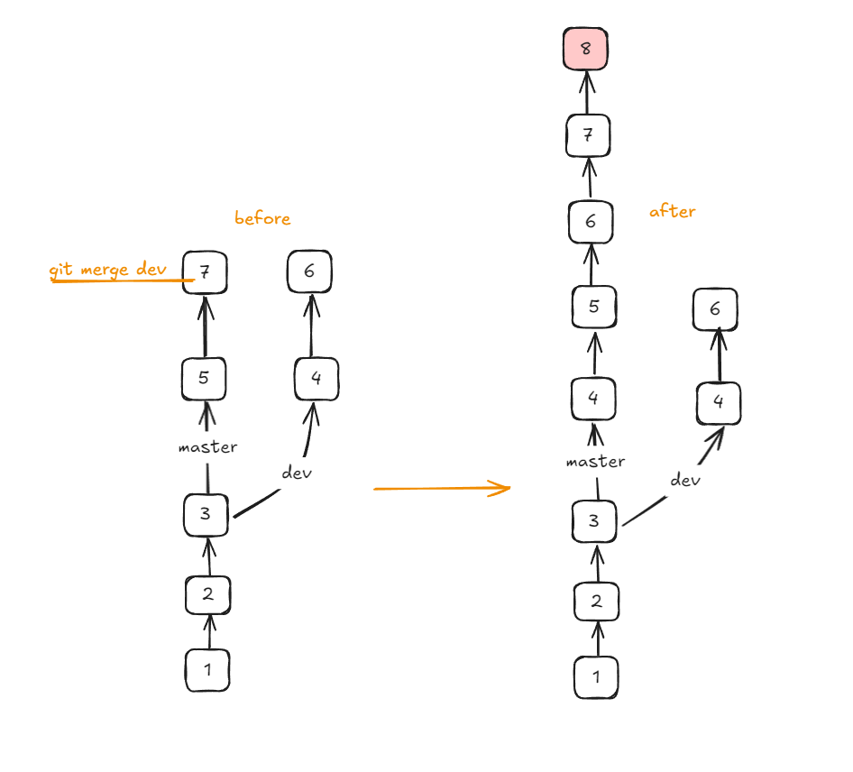
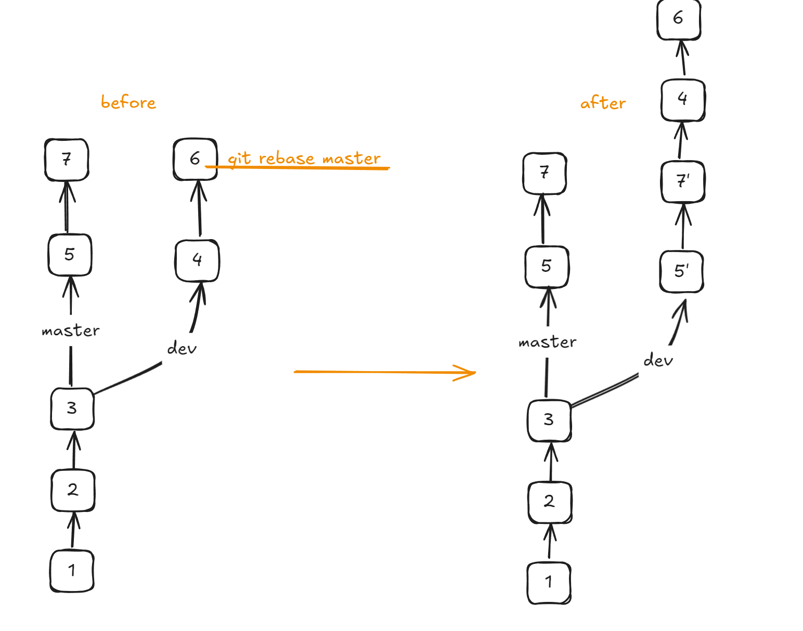

# Github工作流
> 作者: 小王
> 
> 状态: 稳定
>
> :v::eyes::v:


## 基本概念

三个基本对象:

- `Remote`: github远程仓库上的main分支
- `Local`: 本地git仓库
- `Disk`: 本地磁盘


## 示例

1. 将remote的main分支clone到本地

   ```git
   git clone xxx.git
   ```

2. 创建一个新的分支`my-feature`,切换到`my-feature`分支,此时: `my-freture`分支和`main`分支内容相同,磁盘上保存的是`my-feature`分支代码

   ```git
   git checkout -b my-feature
   ```

   > [!tip]
   >
   > `checkout`表示切换到某个分支, 添加`-b`参数表示创建新的分支并切换

3. 在磁盘上进行工作(changes), 完成之后使用`add`, `commit`将代码提交到`my-feature`分支

   ```git
   git diff
   git add .
   git commit -m "f-commit"
   ```

4. 将`my-feature`分支推送到`remote`的`my-feature`分支

   ```git
   git push origin my-feature
   ```

   > [!tip]
   >
   > **origin**: 使用`git clone`后,会默认设置该远程仓库别名为`origin`

5. 此时`remote`的`main`分支很可能相较于我们之前`clone`下来的`main`已经有了变化(其他人的提交),因此需要先在本地切换到`main`分支, 然后将`remote`最新的`main`分支拉取到本地

   ```git
   git checkout main
   git pull origin main
   ```

6. 接下来切换到`my-feature`分支, 使用`rebase`合并本地的`my-feature`和`main`

   ```git
   git rebase main 
   ```

7. 将本地`my-feature`分支推送到`remote`的`my-feature`分支

   ```git
   git push -f origin my-feature
   ```

8. 执行`pull request`操作,即`remote`的`main`分支拉取其他分支的更新

   ```git
   git merge --squash my-feature
   ```

   > [!tip]
   >
   > **squash**: 表示`merge`时将`my-feature`所有的提交合并成一个提交,保证`main`分支的历史提交简洁且可用

9. `remote`端删除`my-feature`分支,本地切换到`main`分支, 删除本地`my-feature`分支, 重新拉取`remote`的`main`分支到本地

## 补充-merge和rebase

**merge**: 



**rebase**: 

