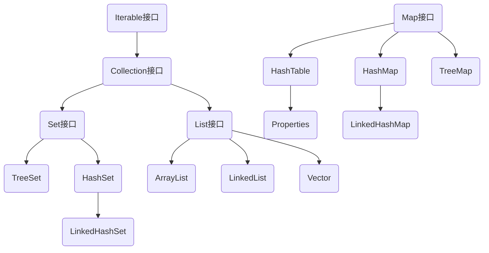

# 集合
> 作者: 小王 :v::eyes::v:
## java集合体系图



## Collection
### Collection接口的常用方法

```java
boolean add();
boolean remove(Object);
Object remove(index);
boolean contains(Object);//查找是否存在
int size();
boolean isEmpty();
void Clear();//清空集合
boolean addAll(Collection);
boolean containsAll(Collection);//判断多个元素是否都存在
boolean removeAll(Collection);//删除多个元素
```


### Collection遍历


**迭代器遍历**

Collection集合都实现了Iterable接口，即Collection集合都有一个Iterator迭代器

Iterator有一个指向集合元素的指针，一开始该指针指向第一个元素之前的位置，next()方法可以让指针后移一位并返回移动后的位置上的元素，HasNext()方法可以判断是否有下一个元素

```java:line-numbers
Collection col = new ArrayList();
for (int i = 0; i < 10; i++) col.add(i + 1);
//先得到集合对应的迭代器
Iterator iterator = col.iterator();
//通过迭代器遍历集合
while (iterator.hasNext()) {
    Object nextEle = iterator.next();
    System.out.println(nextEle);
}
//退出while后，迭代器指针指向集合最后一个元素，需要重置迭代器指针以便下一次遍历
iterator = col.iterator();
```


**增强for遍历**

增强for的底层仍然是迭代器

```java:line-numbers
Collection col = new ArrayList();
for (int i = 0; i < 10; i++) col.add(i + 1);
for (Object Elem: col) {
    System.out.println(Elem);
}
```


## List


**List特点**

1. List接口是Collection接口的子接口
2. 实现List接口的集合添加顺序和取出顺序是一致的，且可以添加重复元素
3. List的底层是数组，因此可以通过索引获取元素，即使用`get(index)`方法


**List接口的常用方法**

```java:line-numbers
void add(index, Object);//在index位置插入元素
boolean addAll(index, Collection);//在index位置处插入一个集合
Object get(index);
int indexOf(Object);//返回Object在集合中首次出现的位置
int lastIndexOf(Object);//返回Object在集合中最后一次出现的位置
Object remove(Object);
Object set(index, Object);//更新index位置处的元素
List subList(fromList, toList);//返回从formList到toList位置处的子集合，前闭后开
```


## ArrayList


### ArrayList特性

1. 可以存放一个或多个`null`
2. 线程不安全
3. `ArrayList`底层维护的是`Object`数组`transient Object[] elementData`
4. 使用无参构造器时，初始`elementData`容量为0，第一次添加，扩容为10，接下来的每次扩容为1.5倍
5. 使用指定大小的构造器时，初始大小为指定大小，接下来每次扩容为1.5倍


### 调用无参构造器

```java:line-numbers
ArrayList list = new ArrayList();
```

```java:line-numbers
//无参构造器
public ArrayList() {
    //将elementData初始化为一个Object空数组
    this.elementData = DEFAULTCAPACITY_EMPTY_ELEMENTDATA;
}
```

这里的`DEFAULTCAPACITY_EMPTY_ELEMENTDATA`定义如下

```java:line-numbers
private static final Object[] DEFAULTCAPACITY_EMPTY_ELEMENTDATA = {};
```


### 使用有参构造器

```java:line-numbers
public ArrayList(int initialCapacity) {
    if (initialCapacity > 0) {
        //使用指定容量构造elementData
        this.elementData = new Object[initialCapacity];
    } else if (initialCapacity == 0) {
        this.elementData = EMPTY_ELEMENTDATA;
    } else {
        throw new IllegalArgumentException("Illegal Capacity: "+
                                           initialCapacity);
    }
}
```


### 添加元素

```java:line-numbers
for (int i = 1; i <= 10; i++) list.add(i);
```

```java:line-numbers
//add方法
public boolean add(E e) {
    //首先对集合的容量进行处理，即确定是否扩容
    ensureCapacityInternal(size + 1);
    //添加元素至elementData中
    elementData[size++] = e;
    return true;
}
```

```java:line-numbers
//确定容量方法
//这里传入的minCapacity是添加元素后集合的大小
private void ensureCapacityInternal(int minCapacity) {
    ensureExplicitCapacity(calculateCapacity(elementData, minCapacity));
}
```

```java:line-numbers
//该方法返回集合所需的最小容量
private static int calculateCapacity(Object[] elementData, int minCapacity) {
    //如果elementData是空数组，那么返回DEFAULT_CAPACITY和minCapacity的最大值
    if (elementData == DEFAULTCAPACITY_EMPTY_ELEMENTDATA) {
        //DEFAULT_CAPACITY常量值为10
        return Math.max(DEFAULT_CAPACITY, minCapacity);
    }
    //elementData不为空数组，返回添加元素后集合的大小
    return minCapacity;
}
```

```java:line-numbers
private void ensureExplicitCapacity(int minCapacity) {
    //modCount用以记录集合被修改的次数
    modCount++;

    //如果所需最小容量大于当前集合容量，则需要扩容
    if (minCapacity - elementData.length > 0)
        grow(minCapacity);
}
```

```java:line-numbers
//扩容方法
private void grow(int minCapacity) {
    // overflow-conscious code
    // oldCapacity记录当前集合长度
    int oldCapacity = elementData.length;
    // 设置newCapacity为当前集合长度的1.5倍
    int newCapacity = oldCapacity + (oldCapacity >> 1);
    // 当oldCapacity为0时，newCapacity为0，这是第一次添加元素时的特殊情况
    // 该if对这种情况进行处理，使得newCapacity值为minCapacity
    // 从这里可以得出，当使用无参构造器时，第一次添加元素时elementData的大小将扩容为10
    // 而如果使用指定size的构造器，第一次添加元素时elementData的大小将扩容为
    if (newCapacity - minCapacity < 0)
        newCapacity = minCapacity;
    // 当newCapacity大于数组最大长度，进行特殊处理
    if (newCapacity - MAX_ARRAY_SIZE > 0)
        newCapacity = hugeCapacity(minCapacity);
    // copyOf方法：返回一个新数组，长度为newCapacity，将elementData中的内容拷贝至新数组中
    // 空出的位置填入null
    elementData = Arrays.copyOf(elementData, newCapacity);
}
```


## Vector


### Vector特性

1. 底层维护的是`Object`数组`protected Object[] elementData`
2. Vector是线程安全的
3. 使用无参构造器时，初始`elementData`容量为0，第一次添加，扩容为10，接下来的每次扩容为2倍
4. 使用指定大小的构造器时，初始大小为指定大小，接下来每次扩容为2倍


### 无参构造器

```java:line-numbers
public Vector() {
    //无参构造器调用可以指定容量的有参构造器，并指定第一次扩容大小为10
    this(10);
}
```

```java:line-numbers
public Vector(int initialCapacity) {
    this(initialCapacity, 0);
}
```

```java:line-numbers
public Vector(int initialCapacity, int capacityIncrement) {
    super();
    if (initialCapacity < 0)
        throw new IllegalArgumentException("Illegal Capacity: "+
                                           initialCapacity);
    this.elementData = new Object[initialCapacity];
    this.capacityIncrement = capacityIncrement;
}
```


### 有参有构造器

与无参构造器基本相同，只不过无参构造器是给定默认大小10，有参构造器是自己指定大小

```java:line-numbers
public Vector(int initialCapacity) {
    this(initialCapacity, 0);
}
```


### 添加元素

```java:line-numbers
public synchronized boolean add(E e) {
    modCount++;//记录修改次数
    ensureCapacityHelper(elementCount + 1);//确定容量
    elementData[elementCount++] = e;//添加元素
    return true;
}
```

```java:line-numbers
private void ensureCapacityHelper(int minCapacity) {
    // 最小所需长度大于当前长度时扩容
    if (minCapacity - elementData.length > 0)
        grow(minCapacity);
}
```

```java:line-numbers
//扩容方法
private void grow(int minCapacity) {
    // oldCapacity记录当前集合长度
    int oldCapacity = elementData.length;
    //扩容算法，capacityIncrement值为0，且一直不变化，因此该算法可以简单看成
    //将newCapacity设置为oldCapacity的两倍
    int newCapacity = oldCapacity + ((capacityIncrement > 0) ?
                                     capacityIncrement : oldCapacity);
    if (newCapacity - minCapacity < 0)
        newCapacity = minCapacity;
    // 当newCapacity大于数组最大长度，进行特殊处理
    if (newCapacity - MAX_ARRAY_SIZE > 0)
        newCapacity = hugeCapacity(minCapacity);
    // 拷贝集合
    elementData = Arrays.copyOf(elementData, newCapacity);
}
```


## LinkedList


### LinkedList特性

1. 底层实现了双向链表和双端队列
2. 线程不安全


### 添加元素

```java
public boolean add(E e) {
    linkLast(e);
    return true;
}
```

```java
//将元素添加至集合尾部
void linkLast(E e) {
    //先将最后一个结点保存至l中
    final Node<E> l = last;
    //新建结点(prev, value, next)，使新结点的前趋指向l
    final Node<E> newNode = new Node<>(l, e, null);
    //使新结点成为last
    last = newNode;
    //当l为空时说明是第一次添加元素
    //否则让l的next指向新结点即可
    if (l == null)
        first = newNode;
    else
        l.next = newNode;
    size++;
    modCount++;
}
```


## Set


**Set特性**

1. Set添加和取出顺序不一致
2. 不允许包含重复元素


## HashSet


**HashSet特性**

`HashSet`底层是`HashMap`，`HashMap`底层是数组加链表加红黑树

`hashMap`中每个结点是一个`Node`，`Node`中包含`hash`，`key`，`value`，`next`四个属性


### 源码解读

```java
transient Node<K,V>[] table;
```


```java
//无参构造器
public HashSet() {
    //从这里能看出HashSet底层维护的是HashMap
    map = new HashMap<>();
}
```

```java
//添加元素方法
public boolean add(E e) {
    //private static final Object PRESENT = new Object();
    return map.put(e, PRESENT)==null;
}
```

```java
public V put(K key, V value) {
    return putVal(hash(key), key, value, false, true);
}
```

```java
//hash方法得到我们要添加的元素的hash值，这里的key即我们要添加的元素
static final int hash(Object key) {
    int h;
    //从这里看出hash算法的值由key的hashCode方法决定
    return (key == null) ? 0 : (h = key.hashCode()) ^ (h >>> 16);
}
```

```java
final V putVal(int hash, K key, V value, boolean onlyIfAbsent, boolean evict) {
    Node<K,V>[] tab; Node<K,V> p; int n, i;
    // 第一次添加数据时，先初始化table
    if ((tab = table) == null || (n = tab.length) == 0)
        n = (tab = resize()).length;
    //i表示结点在table中的索引，可以看出i与table当前的最大容量和hash值有关
    //p记录了table[i]位置上原本的结点
    if ((p = tab[i = (n - 1) & hash]) == null)
        //当要存放到的tab[i]位置为空时，直接将该结点放在tab[i]位置
        //这里可以看出每个Node包含hash，key，value，next四个属性
        tab[i] = newNode(hash, key, value, null);
    else {
        //当table[i]位置不为空时
        Node<K,V> e; K k;
        //这个if用以判断需要添加的结点和p指向的结点是否重复
        //判断重复的条件为：
        //1. hash值相同
        //2. 两个key是同一个对象 或者 用key的equals方法比较后返回true
        if (p.hash == hash &&
            ((k = p.key) == key || (key != null && key.equals(k))))
            e = p;
        //判断p是否是红黑树
        else if (p instanceof TreeNode)
            e = ((TreeNode<K,V>)p).putTreeVal(this, tab, hash, key, value);
        else {//依次比较链表上的各个结点与要添加的结点是否重复，如果不重复就添加在链表最后
            for (int binCount = 0; ; ++binCount) {
                //如果下一个结点为空，那么直接将新结点接在p之后，然后退出循环
                if ((e = p.next) == null) {
                    p.next = newNode(hash, key, value, null);
                    //static final int TREEIFY_THRESHOLD = 8;
                    //当该链表上的结点个数大于等于8，就进入树化方法treeifyBin(tab, hash)
                    //treeifyBin(tab, hash)内部还会进行一次判断，即只有当table的大小大于
                    //64时才会真正进行树化，否则只会执行resize()方法
                    //从这里可以得出树化的条件：1. table大小大于64  2. 链表长度大于等于8 
                    if (binCount >= TREEIFY_THRESHOLD - 1) // -1代表第一个结点
                        treeifyBin(tab, hash);
                    break;
                }
                //比较过程中发现了重复的结点，则放弃添加，退出循环
                if (e.hash == hash &&
                    ((k = e.key) == key || (key != null && key.equals(k))))
                    break;
                p = e;
            }
        }
        if (e != null) { // existing mapping for key
            V oldValue = e.value;
            if (!onlyIfAbsent || oldValue == null)
                e.value = value;
            //这是一个空方法
            afterNodeAccess(e);
            //当添加失败时，返回value，PRESENT
            return oldValue;
        }
    }
    ++modCount;
    //添加完结点后，如果此时table的结点个数大于扩容所需容量，那么就进行扩容
    if (++size > threshold)
        resize();
    //这是一个空方法
    afterNodeInsertion(evict);
    //返回null代表添加成功
    return null;
}
```

```java
final Node<K,V>[] resize() {
    //将table保存在oldTab中
    Node<K,V>[] oldTab = table;
    int oldCap = (oldTab == null) ? 0 : oldTab.length;
    // threshold为当前table的需要扩容时的大小
    int oldThr = threshold;
    int newCap, newThr = 0; 
    if (oldCap > 0) {
        if (oldCap >= MAXIMUM_CAPACITY) {
            threshold = Integer.MAX_VALUE;
            return oldTab;
        }
        //从这里看出每次扩容时newCap扩容为原来的两倍
        else if ((newCap = oldCap << 1) < MAXIMUM_CAPACITY &&
                 oldCap >= DEFAULT_INITIAL_CAPACITY)
            //newThr即threshold也扩容为原来的两倍，等价于newCap * DEFAULT_LOAD_FACTOR
            newThr = oldThr << 1; // double threshold
    }
    else if (oldThr > 0) // initial capacity was placed in threshold
        newCap = oldThr;
    else {
        // static final int DEFAULT_INITIAL_CAPACITY = 1 << 4（即16），表示第一次添加数据         //时table表的大小
        newCap = DEFAULT_INITIAL_CAPACITY;
        // DEFAULT_LOAD_FACTOR值为0.75，表示加载因子，当table当前元素个数达到0.75倍容量后
        // 会进行扩容
        newThr = (int)(DEFAULT_LOAD_FACTOR * DEFAULT_INITIAL_CAPACITY);
    }
    if (newThr == 0) {
        float ft = (float)newCap * loadFactor;
        newThr = (newCap < MAXIMUM_CAPACITY && ft < (float)MAXIMUM_CAPACITY ?
                  (int)ft : Integer.MAX_VALUE);
    }
    //更新threshold值
    threshold = newThr;
    @SuppressWarnings({"rawtypes","unchecked"})
    //用newCap大小来创建table
    Node<K,V>[] newTab = (Node<K,V>[])new Node[newCap];
    table = newTab;
    if (oldTab != null) {
        for (int j = 0; j < oldCap; ++j) {
            Node<K,V> e;
            if ((e = oldTab[j]) != null) {
                oldTab[j] = null;
                if (e.next == null)
                    newTab[e.hash & (newCap - 1)] = e;
                else if (e instanceof TreeNode)
                    ((TreeNode<K,V>)e).split(this, newTab, j, oldCap);
                else { // preserve order
                    Node<K,V> loHead = null, loTail = null;
                    Node<K,V> hiHead = null, hiTail = null;
                    Node<K,V> next;
                    do {
                        next = e.next;
                        if ((e.hash & oldCap) == 0) {
                            if (loTail == null)
                                loHead = e;
                            else
                                loTail.next = e;
                            loTail = e;
                        }
                        else {
                            if (hiTail == null)
                                hiHead = e;
                            else
                                hiTail.next = e;
                            hiTail = e;
                        }
                    } while ((e = next) != null);
                    if (loTail != null) {
                        loTail.next = null;
                        newTab[j] = loHead;
                    }
                    if (hiTail != null) {
                        hiTail.next = null;
                        newTab[j + oldCap] = hiHead;
                    }
                }
            }
        }
    }
    return newTab;
}
```


## hashCode和equals


### hashCode()

**Object**类的hashCode方法是一个本地方法,与对象的地址有关

```java
public native int hashCode();
```


**Objects**类的hashCode方法，调用的仍然是Object类的hashCode

```java
public static int hashCode(Object o) {
    return o != null ? o.hashCode() : 0;
}
```


**Objects**类的hash方法，可以传入多个对象的可变参数，调用Arrays类的hashCode

```java
public static int hash(Object... values) {
    return Arrays.hashCode(values);
}
```


**Arrays**类中的hashCode方法，由数组中每个对象的hashCode计算出一个综合的result值

```java
public static int hashCode(Object a[]) {
    if (a == null)
        return 0;

    int result = 1;

    for (Object element : a)
        result = 31 * result + (element == null ? 0 : element.hashCode());

    return result;
}
```


数据类型对应的类，例如Integer，String，他们的hashCode方法都没有调用Object的hashCode方法，而是根据value来计算一个hashCode值

例如Integer的hashCode方法如下

```java
public static int hashCode(int value) {
    //直接以value值作为hashCode值
    return value;
}
```

String的hashCode方法如下

```java

public int hashCode() {
    int h = hash;//private int hash，即0
    if (h == 0 && value.length > 0) {
        char val[] = value;

        for (int i = 0; i < value.length; i++) {
            //以字符串中的每个字符作为映射返回hashCode值
            h = 31 * h + val[i];
        }
        hash = h;
    }
    return h;
}
```


重写某个类的hashCode方法时，一般使用Objects的hash方法，因为可以传入可变参数

例如给某个Employee类重写hashCode方法

```java
@Override
public int hashCode() {
    return Objects.hash(name, age);
}
```


### equals()


Object类的equals方法，比较的是两个对象是否是同一个对象

```java
public boolean equals(Object obj) {
    return (this == obj);
}
```


Objects类的equals方法，比较的是两个对象是否是同一个对象或者调用对象的equals方法是否返回true

```java
public static boolean equals(Object a, Object b) {
    return (a == b) || (a != null && a.equals(b));
}
```


## LinkedHashSet


**LinkedHashSet特性**

1. 是HashSet的子类
2. 底层维护的是LinkedHashMap，即一个数组加双向链表
3. 元素的添加和取出顺序一致


`LinkedHashMap`与`HashMap`基本结构相同，都是一个头结点数组的形式，每个头结点处可以形成一条链表，只不过`LinkedHashMap`中每个结点多了`before`和`after`指针，将所有结点连接成了一个双向链表，而在`HashMap`中，不同头结点代表的链表上的结点间是没有连接的

`LinkedHashMap`中的每个结点是一个`Entry`，`Entry`，继承了`Node`，同时多了`before`和`after`两个属性


## Map


**Map特性**

1. `Map`用于保存具有映射关系的数据Key-value，在`Collection`中，要么没有`value`，要么`value`用一个静态的公共对象象征性填充
   1. `Map`在添加元素时不能添加相同key元素，如果key相同，那么会替换value值，而value则不受限制，即允许key不同但value相同


**常用方法**

- put (key, value)
- remove (key)
- get (key)
- size ()
- isEmpty ()
- clear ()
- containsKey () 查找key是否存在


## EntrySet

`Map`接口中的`Entry`接口，提供了`getKey`和`getValue`方法

```java
interface Entry<K,V> {
    K getKey();
    V getValue();
    //省略了其他成员
}
```


`HashMap`中的`EntrySet`字段

可以看出`hashMap`中的`entrySet`字段是一个`Set`，其内元素的数据类型是实现了`Map`中的`Entry`接口的类

```java
transient Set<Map.Entry<K,V>> entrySet;
```


`HashMap`中的`EntrySet`方法，用以返回HashMap中的`entrySet`属性

```java
public Set<Map.Entry<K,V>> entrySet() {
    Set<Map.Entry<K,V>> es;
    return (es = entrySet) == null ? (entrySet = new EntrySet()) : es;
}
```


`HashMap`中的`Node`类，实现了`Map`中的`Entry`接口，因此`HashMap`的`entrySet`中存放的实际上是实现了`Map`中的`Entry`接口的`Node`

```java
static class Node<K,V> implements Map.Entry<K,V> {
    //省略了内部成员
}
```


**总结**

HashMap中有一个字段entrySet，它其实是一个Set集合，里面存放的元素类型用泛型指定为了Entry，这个Entry是Map中的一个接口，HashMap中的Node实现了这个接口，所以entrySet里面存放的实际上是Node，之所以把Node放在entrySet中，是因为Map系列的集合没有迭代器，所以为了方便遍历元素，将元素放在一个Set集合entrySet中，这样就可以使用entrySet的迭代器（增强for来遍历元素了），同时Map中的Entry接口提供了两个重要方法getKey和getValue可以很方便地获取key和value


**keySet&values**

AbstractMap中

```java
transient Set<K>        keySet;
transient Collection<V> values;
```

即除了使用entrySet遍历node外，也可以用KeySet遍历key，或是用values遍历value


## Map的遍历


### keySet

keySet是一个Set集合，其内保存所有的key，可以使用增强for和迭代器方式遍历元素

```java
Set set = hashMap.keySet();
//增强for
for (Object key : set) {
    System.out.println(key + " " + hashMap.get(key));
}
//迭代器
Iterator iterator = set.iterator();
while (iterator.hasNext()) {
    System.out.println(iterator.next());
}
```


### values

values是一个Collection集合，其内保存了所有的value，可以可以使用增强for和迭代器方式遍历元素


### entrySet

使用迭代器或者增强for

```java
Set set = hashMap.entrySet();
for (Object o : set) {
    Map.Entry entry = (Map.Entry) o;
    System.out.println(entry.getKey() + " " + entry.getValue());
}
```


## HashTable


**特性**

1. key和value都不能为null
2. 线程安全
3. 第一次扩容大小为10，以后每次扩容大小为原来的2倍再加一


