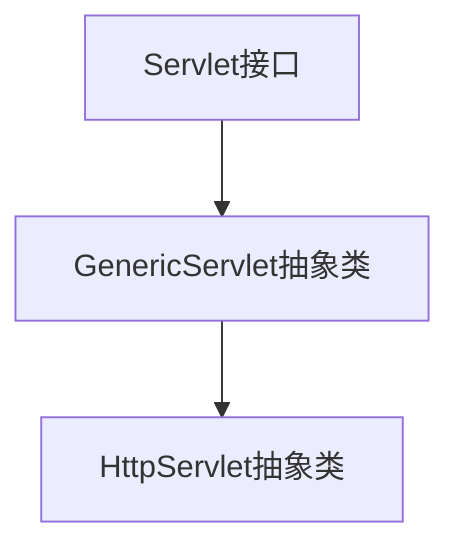

# Servlet

> 作者: 小王:v::eyes::v:


## web概述

**1. Servlet**

`Jakarta EE`(`Java EE`)规范中定义了`Servlet`接口及其API,这个接口是最基础的处理`HTTP`请求的机制,所有实现Java Web功能的框架(例如`Spring`等）在底层都是基于`Servlet`,或对`servlet`进行封装来处理`HTTP`请求和响应的

**2. Servlet容器(web服务器)**

> 所有的`Servlet`本质上只是一个实现了`javax.servlet.Servlet`接口的Java类,`Servlet`仅仅定义了业务逻辑的处理, 但是开发一个完整的Web应用并不仅仅是编写业务逻辑，还需要处理许多底层的细节，如网络协议、并发处理、会话管理等。

`Servlet容器`提供了运行Servlet的环境,提供以下功能:

- HTTP协议解析, 网络通信
- 多线程管理
- `Servlet`生命周期管理
- 请求和响应对象的创建(`HttpServletRequest`和`HttpServletResponse`)
- 管理`Session`、`Cookie`

典型的servlet容器: `Tomcat`

**3. 一句话总结**

Servlet容器(例如`Tomcat`)用于接收客户端(浏览器)传来的http请求,将请求封装成`HttpServletRequest`对象, 交给`Servlet`,或者封装了servlet的框架(例如`Spring MVC`)进行业务处理,并将处理完成的数据存储到Servlet容器提供的`HttpServletResponse`对象中, Servlet容器再根据`HttpServletResponse`对象将实际的HTTP响应发送给客户端(浏览器)


## hello, servlet

**目标: 实现Service接口创建一个简单的servlet**:+1:

> [!tip]
>
> `jakarta`包属于`Jakarta EE`规范的实现, 而JKD是`Java SE`的实现, 默认不包括`Jakarta EE`的组件,因此想要在`Java SE`工程中使用`jakarta`包下的`Servlet`,是需要引入对应的依赖的
>
> 这里使用了idea创建jakarta EE工程,并配置了Tomcat服务器


先编写一个类实现Servlet接口

实现Servlet后需要实现其接口方法，其中`service`方法用来处理请求，并相应数据

```java
import jakarta.servlet.*;
public class Servlet_ implements Servlet {
    @Override
    public void service(ServletRequest servletRequest, ServletResponse servletResponse) throws ServletException, IOException {
    	System.out.println("hello,servlet");
	}
}
```


在`web.xml`中配置Servlet程序的访问地址

```xml
<?xml version="1.0" encoding="UTF-8"?>
<web-app xmlns="http://xmlns.jcp.org/xml/ns/javaee"
         xmlns:xsi="http://www.w3.org/2001/XMLSchema-instance"
         xsi:schemaLocation="http://xmlns.jcp.org/xml/ns/javaee http://xmlns.jcp.org/xml/ns/javaee/web-app_4_0.xsd"
         version="4.0">
<!--    servlet标签给Tomcat服务器配置我们写好的servlet类的程序-->
    <servlet>
<!--        servlet-name标签给servlet程序取一个别名，通常使用类名-->
        <servlet-name>Servlet_</servlet-name>
<!--        servlet-class是servlet的全类名-->
        <servlet-class>com.origin.Servlet.Servlet_</servlet-class>
    </servlet>
<!--    servlet-mapping标签给servlet程序配置访问地址-->
    <servlet-mapping>
<!--        该servlet-name用以表明要给哪个servlet程序配置地址-->
        <servlet-name>Servlet_</servlet-name>
<!--        url-pattern标签用以配置访问地址
            '/'在解析时表示http://ip:port/工程路径/
            因此/hello表示http://ip:port/工程路径/hello
            这里的工程路径即该项目启动时进入的路径-->
        <url-pattern>/hello</url-pattern>
    </servlet-mapping>
</web-app>
```


配置完成后，就可以通过配置好的地址访问`servlet`程序，例如此处使用`http://locathost:8080/servlet01/hello`来访问`servlet`程序

其原理是，`http://locathost:8080`能过连接到指定主机的指定端口，即服务器的8080端口上的`tomcat`服务，`/servlet` 为工程路径，指定了访问哪个工程，`/hello` 为资源路径，资源路径通过`servlet-mapping`中的`url-pattern`定位到指定`servlet`，查找到`servlet-name`，再通过`servlet-name`查找到servlet的全类名`servlet-class`，再执行该`servlet`类中的`service`方法


## Servlet继承体系



`Servlet`接口

```java
public interface Servlet {
    // 初始化方法, 当Servlet被实例化后,调用此方法
    void init(ServletConfig var1) throws ServletException;

    // ServletConfig对象包含了Servlet的基本配置信息
    ServletConfig getServletConfig();

    // 每当有请求,就会调用这个方法
    void service(ServletRequest var1, ServletResponse var2) throws ServletException, IOException;
	
    // 返回关于Servlet的基本信息，如Servlet的作者、版本等
    // 这是一个可选实现的方法，通常用于调试或文档生成。
    String getServletInfo();
    
	// 当Servlet生命周期结束时（比如服务器关闭或应用程序重新部署时），该方法被调用一次
    void destroy();
    
    // ......
}
```


`GenericServlet`抽象类

```java
public abstract class GenericServlet implements Servlet, ServletConfig, Serializable {
    // 持有一个ServletConfig对象
    private transient ServletConfig config;
    
    // 在init方法中给ServletConfig对象赋值
    public void init(ServletConfig config) throws ServletException {
        this.config = config;
        this.init();
    }
    
    // 继续声明抽象方法service
    public abstract void service(ServletRequest var1, ServletResponse var2) throws ServletException, IOException;
    
    
    // ......
}
```


`HttpServlet`抽象类

```java
public abstract class HttpServlet extends GenericServlet {
    // 对service方法做了具体实现
    // 简化后的service方法
	public void service(ServletRequest req, ServletResponse res) {
        // 将请求和响应对象转为更具体的http请求和http响应对象
        HttpServletRequest request = (HttpServletRequest)req;
        HttpServletResponse response = (HttpServletResponse)res;
        // 调用重载的service方法
        this.service(request, response);
    }
    
    // 简化后的重载的service方法
    protected void service(HttpServletRequest req, HttpServletResponse resp) {
        // 根据请求类型执行相应的方法
        String method = req.getMethod();
        if (method.equals("GET")) {
            this.doGet(req, resp);
        } else if (method.equals("POST")) {
            this.doPost(req, resp);
        }
        // ......
    }
    
    // doGet, doPost等方法在HttpServlet中的实现都是基本相同的,都是发送一个错误信息405
    // 因此我们需要自己定义一个HttpServlet的子类,通过重写doGet,doPost等方法来实现
    // 具体的业务逻辑
	protected void doGet(HttpServletRequest req, HttpServletResponse resp) {
        String msg = lStrings.getString("http.method_get_not_supported");
        this.sendMethodNotAllowed(req, resp, msg);
    }
    
    // ......
}
```


**总结**: 

- 原生`Servlet`开发web应用, 需要我们自定义具体的`Servlet`类,并在`web.xml`中注册该类并配置其对应的url,该`Servlet`类需要继承`HttpServlet`然后重写其中的`doGet`, `doPost`等方法来实现具体的业务逻辑
- 框架开发web应用,其底层也是对`service`方法的封装, 比如`Spring MVC`的`DispatcherServlet`继承了`HttpServlet`，并重写了`service()`方法来拦截所有请求。


## ServletConfig

每个`Servlet`都持有一个`ServletConfig`对象实例

```java
public interface ServletConfig {
    
    // 获取该Servlet的名称
    String getServletName();

    // 获取ServletContext对象
    ServletContext getServletContext();

    // 获取初始化参数(可以在web.xml中配置)
    String getInitParameter(String var1);

    // 获取所有初始化参数的名字, 保存在一个迭代器中
    Enumeration<String> getInitParameterNames();
}
```


## ServletContext

所有Servlet共享一个`ServletContext`单例,通过`ServletContext`设置的属性参数可以被所有的`servlet`访问到

```java
public interface ServletContext {
    
    // ......
}
```


> [!note]
>
> **关于域对象**
>
> 域对象用于在不同的范围内存储和共享数据, java web项目中的域对象:
>
> | **特性**     | **ServletContext**                          | **HttpSession**                      | **HttpServletRequest**         |
> | ------------ | ------------------------------------------- | ------------------------------------ | ------------------------------ |
> | **作用范围** | 整个Web应用                                 | 每个客户端                           | 单次请求                       |
> | **共享级别** | 所有用户和所有组件共享                      | 只在同一用户的多次请求之间共享       | 只在当前请求内有效             |
> | **生命周期** | 与 Web 应用相同，应用启动时创建，停止时销毁 | 与用户会话相同，超时或主动注销时销毁 | 与单次请求相同，请求结束时销毁 |


